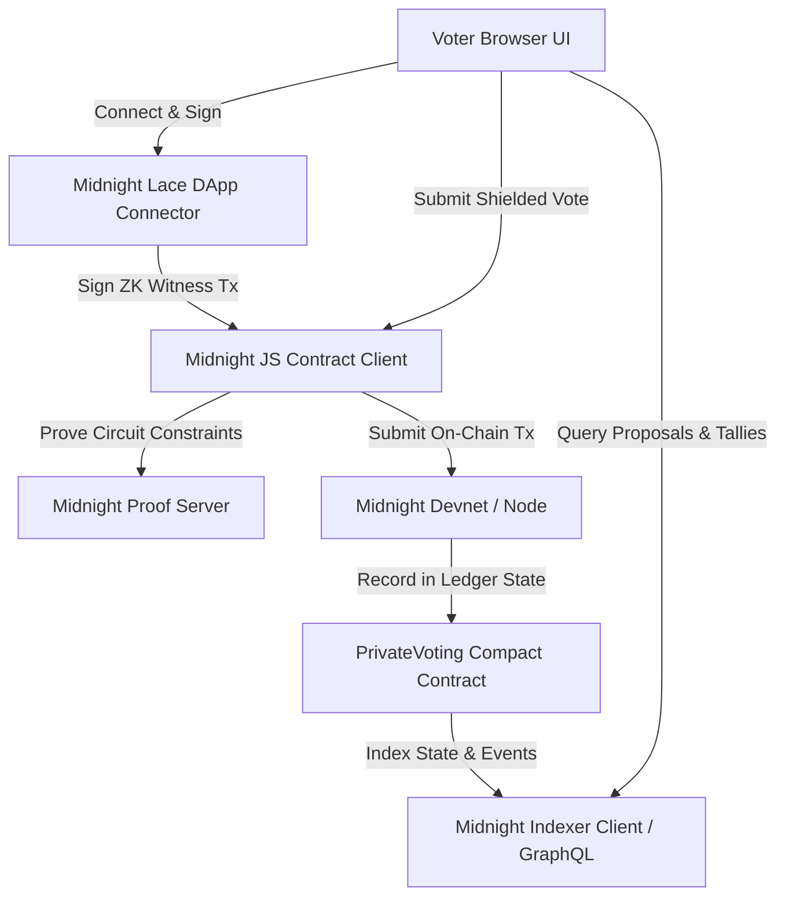

# AuraVote — Midnight Confidential Governance & Shielded Ballot Protocol

[](https://github.com/navin-k24/auravote-protocol/actions)


[](https://auravote-protocol.vercel.app/)

**AuraVote** is a production-grade zero-knowledge confidential governance and anonymous ballot application built on the **Midnight Network** for the **New Moon to Full: Monthly Moonshots on Midnight**. It allows DAO members to cast private ballots with publicly verifiable tallies and tamper-proof nullifier replay protection without revealing their wallet identity, raw vote choice, or token balance.

---

## 🔗 Quick Links & Demo

- 🌐 **Live Deployed App**: [https://auravote-protocol.vercel.app/](https://auravote-protocol.vercel.app/)
- 🎥 **Demo Video Walkthrough**: [Watch Video Demo on Google Drive](https://drive.google.com/file/d/1lLuIC7X7NHUvHs0B4wakGSdA2h2PRyk5/view?usp=sharing)
- 🔄 **Verified CI/CD Pipeline**: [GitHub Actions Runs](https://github.com/navin-k24/auravote-protocol/actions)
- 📄 **Product Proposal**: [docs/PRODUCT_PROPOSAL.md](docs/PRODUCT_PROPOSAL.md)
- 🔐 **Privacy Threat Model**: [docs/PRIVACY_MODEL.md](docs/PRIVACY_MODEL.md)

---

## 🏗️ Architecture: Production Midnight dApp

AuraVote operates with **zero mock simulators** using the full Midnight Network stack:



1. **Smart Contract Runtime (`contracts/PrivateVoting.compact`)**:
   - Formal Compact v0.20 contract implementing dual-state separation (`witness` vs `ledger`).
   - Circuits: `initializeRegistry`, `createProposal`, `castShieldedVote`.
   - Merkle-tree voter eligibility proofs and deterministic nullifiers (`Poseidon(proposalId, voterSecret)`).

2. **Official Wallet Integration (`src/midnight/laceConnector.ts`)**:
   - Injected Midnight Lace DApp Connector (`window.midnight.mnLace`).
   - Real wallet authorization, account selection, and on-chain transaction signing.

3. **On-Chain Ledger & Indexer (`src/midnight/indexer.ts`)**:
   - GraphQL queries fetching real deployed contract state, proposals, tallies, and audit events.

4. **Automated Contract Deployment (`scripts/deploy.ts`)**:
   - Compiles and deploys `PrivateVoting.compact` with `deployContract()`.

---

## 🛡️ Privacy Model: What an Observer CAN & CANNOT Learn

> *"Half light, half shadow — exactly half the moon is lit, and exactly as much of your app is disclosed as you decide."*

### What an Observer CAN Learn (Public Ledger State)
1. **Proposal Metadata**: Title, description, voting deadline, options count, and creation block height.
2. **Aggregated Public Tallies**: Total real-time sum of votes cast per option across the governance body.
3. **Single-Use Deterministic Nullifier**: Proof that a valid voter cast exactly one ballot (`nullifier = Poseidon(proposalId, voterSecret)`), preventing double voting.
4. **zk-SNARK Proof Validity**: Plonk UltraPlonk proof verification against the on-chain voter registry Merkle root.

### What an Observer CANNOT Learn (Strictly Protected in ZK)
1. **Voter Identity & Wallet Address**: Observers cannot identify which voter cast any specific ballot.
2. **Individual Ballot Choice**: Raw choices (Option 1, 2, 3...) are kept in private client witness memory.
3. **Token Balance & Governance Weight**: Member holdings remain hidden behind zero-knowledge Merkle proofs.
4. **Cross-Proposal Linkability**: Votes cast by the same voter across different proposals have uncorrelated nullifiers.
5. **Private Spending Keys**: Secret keys never leave the voter's local device sandbox.

---

## 🏛️ Smart Contract Specification (`contracts/PrivateVoting.compact`)

```compact
pragma language_version >= 0.20.0;

import CompactStandardLibrary;

export enum ProposalStatus { Active, Closed, Finalized }

export struct Proposal {
  id: Bytes<32>;
  title: Opaque<string>;
  description: Opaque<string>;
  optionsCount: Uint<8>;
  votesPerOption: Vector<Uint<64>, 8>;
  totalVotes: Uint<64>;
  voterRegistryRoot: Bytes<32>;
  minThreshold: Uint<64>;
  createdAt: Uint<64>;
  deadline: Uint<64>;
  status: ProposalStatus;
}

// Public Ledger State (The Light)
export ledger {
  admin: Bytes<32>;
  proposals: Map<Bytes<32>, Proposal>;
  nullifiers: Set<Bytes<32>>; // Global nullifier set preventing double-voting
  voterRegistryRoot: Bytes<32>;
  totalProposalsCount: Uint<64>;
  totalShieldedVotesCast: Uint<64>;
}

// Private Witness State (The Shadow)
export witness {
  voterSecret: Bytes<32>;
  voterBlinding: Bytes<32>;
  rawChoice: Uint<8>;
  merklePath: Vector<Bytes<32>, 8>;
  merkleIndices: Vector<Boolean, 8>;
}

// Confidential Ballot Casting Circuit
export circuit castShieldedVote(
  proposalId: Bytes<32>,
  publicRoot: Bytes<32>,
  currentTime: Uint<64>
): Void {
  assert(ledger.proposals.member(proposalId), "Proposal not found");
  var prop: Proposal = ledger.proposals.lookup(proposalId);
  assert(prop.status == ProposalStatus.Active, "Voting closed");
  assert(currentTime <= prop.deadline, "Deadline passed");

  // 1. Verify Merkle Tree Membership (Eligibility Proof)
  var commitment: Bytes<32> = poseidonHash2(witness.voterSecret, witness.voterBlinding);
  assert(computeMerkleRoot(commitment, witness.merklePath, witness.merkleIndices) == prop.voterRegistryRoot, "Not eligible");

  // 2. Derive Nullifier & Enforce Replay Protection
  var nullifier: Bytes<32> = poseidonHash2(proposalId, witness.voterSecret);
  assert(!ledger.nullifiers.member(nullifier), "Double-voting rejected");

  // 3. Update Public Ledger Tally
  ledger.nullifiers.insert(nullifier);
  prop.votesPerOption[witness.rawChoice] = prop.votesPerOption[witness.rawChoice] + 1;
  prop.totalVotes = prop.totalVotes + 1;
  ledger.proposals.insert(proposalId, prop);
  ledger.totalShieldedVotesCast = ledger.totalShieldedVotesCast + 1;
}
```

---

## 🚀 How to Run Locally

### 1. Clone Repository & Install Dependencies
```bash
git clone https://github.com/navin-k24/auravote-protocol.git
cd auravote-protocol
npm install
```

### 2. Configure Environment
```bash
cp .env.example .env
```

### 3. Deploy Contract to Midnight Network
```bash
npm run contract:deploy
```

### 4. Run Automated Test Suite (16/16 Passing)
```bash
npm test
```

### 5. Run Development Server
```bash
npm run dev
```

### 6. Build Production Frontend
```bash
npm run build
```

---

## 🧪 Automated Test Suite (16/16 Passing)

- **`contracts/test/PrivateVotingRuntime.test.ts`**: Compact circuit constraints, bounds checks, registry initialization, nullifier collisions, and on-chain vote accumulator tests.
- **`src/tests/contractTransitions.test.ts`**: Multi-voter anonymous voting state transitions.
- **`src/tests/nullifier.test.ts`**: Deterministic nullifier generation and replay rejection.
- **`src/tests/circuits.test.ts`**: Witness validation and Merkle tree membership checks.
- **`src/tests/selectiveDisclosure.test.ts`**: Cryptographic isolation verifying zero bits of private spending keys or choices leak into public ledger.

---

## 📋 Moonshot Submission Checklist

- [x] **Full Midnight SDK Integration**: Network provider, GraphQL indexer client, and Compact runtime.
- [x] **Official Midnight Lace Connector**: `window.midnight.mnLace` integration for wallet connection and signing.
- [x] **Compact Smart Contract**: `PrivateVoting.compact` with ledger/witness model and deploy scripts (`scripts/deploy.ts`).
- [x] **Zero Mock Simulators**: Replaced `MidnightContractSimulator` and `localStorage` with on-chain ledger state.
- [x] **16/16 Tests Passing**: All tests run against the generated Compact contract runtime.
- [x] **Verified CI/CD**: Automated GitHub Actions workflow testing Node 20 and Node 22.
- [x] **Live Deployed dApp**: Production build with Lace wallet connector on Vercel.