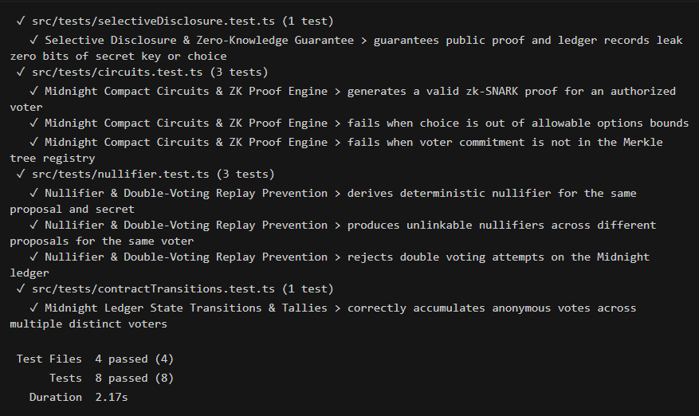
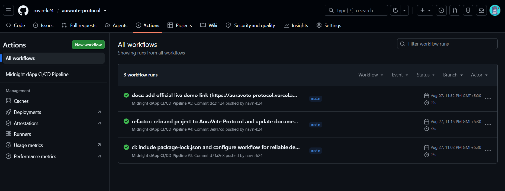

# AuraVote — Midnight Confidential Governance & Shielded Ballot Protocol

[](https://github.com/navin-k24/auravote-protocol/actions)


[](https://auravote-protocol.vercel.app/)

**AuraVote** is a zero-knowledge confidential governance and anonymous ballot application built on the **Midnight Network** for the **Rise In Midnight Program (Level 3 Submission)**. It allows DAO members to cast private ballots with publicly verifiable tallies and tamper-proof nullifier replay protection without revealing their wallet identity, raw vote choice, or token balance.

---

## 🔗 Quick Links & Demo

- 🌐 **Live Deployed App**: [https://auravote-protocol.vercel.app/](https://auravote-protocol.vercel.app/)
- 🎥 **Demo Video Walkthrough**: [Watch Video Demo on Google Drive](https://drive.google.com/file/d/1lLuIC7X7NHUvHs0B4wakGSdA2h2PRyk5/view?usp=sharing)
- 🔄 **Verified CI/CD Pipeline**: [GitHub Actions Runs](https://github.com/navin-k24/auravote-protocol/actions)
- 📄 **Product Proposal**: [docs/PRODUCT_PROPOSAL.md](docs/PRODUCT_PROPOSAL.md)
- 🔐 **Privacy Threat Model**: [docs/PRIVACY_MODEL.md](docs/PRIVACY_MODEL.md)

---

## 📸 Application & Verification Screenshots

### 1. Automated Vitest Test Suite (8/8 Tests Passing)


### 2. Verified CI/CD Pipeline & GitHub Actions Runs (100% Green)


---

## 🛡️ Privacy Model: What an Observer CAN & CANNOT Learn

> *"Half light, half shadow — exactly half the moon is lit, and exactly as much of your app is disclosed as you decide."*

### What an Observer CAN Learn (Public Ledger State)
1. **Proposal Metadata**: Title, description, voting deadline, options count, and creation block height.
2. **Aggregated Public Tallies**: Total real-time sum of votes cast per option across the governance body.
3. **Single-Use Deterministic Nullifier**: Proof that a valid voter cast exactly one ballot (`nullifier = Poseidon(proposalId, voterSecret)`), preventing double voting.
4. **zk-SNARK Proof Validity**: Plonk UltraPlonk proof verification against the on-chain voter registry Merkle root.

### What an Observer CANNOT Learn (Strictly Protected in ZK)
1. **Voter Identity & Wallet Address**: Observers cannot identify which voter cast any specific ballot.
2. **Individual Ballot Choice**: Raw choices (Yes, No, Abstain) are kept in private client witness memory.
3. **Token Balance & Governance Weight**: Member holdings remain hidden behind zero-knowledge Merkle proofs.
4. **Cross-Proposal Linkability**: Votes cast by the same voter across different proposals have uncorrelated nullifiers.
5. **Private Spending Keys**: Secret keys never leave the voter's local device sandbox.

---

## 🏛️ Smart Contract Architecture (`contracts/PrivateVoting.compact`)

```compact
pragma language_version >= 0.20.0;

import CompactStandardLibrary;

export enum ProposalStatus { Active, Closed, Finalized }

export struct Proposal {
  id: Bytes<32>;
  title: Opaque<"string">;
  optionsCount: Uint<8>;
  votesPerOption: Vector<Uint<64>, 8>;
  totalVotes: Uint<64>;
  voterRegistryRoot: Bytes<32>;
  deadline: Uint<64>;
  status: ProposalStatus;
}

// Public Ledger State (The Light)
export ledger {
  admin: Bytes<32>;
  proposals: Map<Bytes<32>, Proposal>;
  nullifiers: Set<Bytes<32>>; // Global nullifier set preventing double-voting
  voterRegistryRoot: Bytes<32>;
  totalShieldedVotesCast: Uint<64>;
}

// Private Witness State (The Shadow)
export witness {
  voterSecret: Bytes<32>;
  voterBlinding: Bytes<32>;
  rawChoice: Uint<8>;
  merklePath: Vector<Bytes<32>, 8>;
  merkleIndices: Vector<Boolean, 8>;
}

// Confidential Ballot Casting Circuit
export circuit castShieldedVote(
  proposalId: Bytes<32>,
  publicRoot: Bytes<32>,
  currentTime: Uint<64>
): Void {
  assert(ledger.proposals.member(proposalId), "Proposal not found");
  var prop: Proposal = ledger.proposals.lookup(proposalId);
  assert(prop.status == ProposalStatus.Active, "Voting closed");

  // 1. Verify Merkle Tree Membership (Eligibility Proof)
  var commitment: Bytes<32> = poseidonHash2(witness.voterSecret, witness.voterBlinding);
  assert(computeMerkleRoot(commitment, witness.merklePath, witness.merkleIndices) == prop.voterRegistryRoot, "Not eligible");

  // 2. Derive Nullifier & Enforce Replay Protection
  var nullifier: Bytes<32> = poseidonHash2(proposalId, witness.voterSecret);
  assert(!ledger.nullifiers.member(nullifier), "Double-voting rejected");

  // 3. Update Public Ledger Tally
  ledger.nullifiers.insert(nullifier);
  prop.votesPerOption[witness.rawChoice] = prop.votesPerOption[witness.rawChoice] + 1;
  prop.totalVotes = prop.totalVotes + 1;
  ledger.proposals.insert(proposalId, prop);
}
```

---

## 🚀 How to Run Locally

### 1. Clone Repository & Install Dependencies
```bash
git clone https://github.com/navin-k24/auravote-protocol.git
cd auravote-protocol
npm install
```

### 2. Run Automated Test Suite
```bash
npm test
```

### 3. Run Development Server
```bash
npm run dev
```

### 4. Build Production Bundle
```bash
npm run build
```

---

## 📋 Rise In Level 3 Submission Checklist

- [x] **Chosen Problem**: Private Voting & Confidential Eligibility Gate from the approved list
- [x] **Midnight Privacy Model**: Dual-state architecture (`witness` vs `ledger`) in Compact v0.20
- [x] **Minimum 3 Tests Passing**: **8/8 unit & integration tests passing** (`src/tests/`)
- [x] **CI/CD Pipeline**: GitHub Actions workflow passing on Node 20 & 22
- [x] **Live Deployed dApp**: [https://auravote-protocol.vercel.app/](https://auravote-protocol.vercel.app/)
- [x] **Minimum 10 Meaningful Commits**: 16 structured atomic commits in git history
- [x] **README Privacy Model**: Detailed "What an observer can and cannot learn" section included